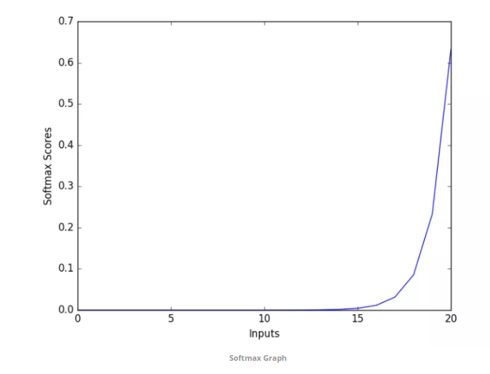
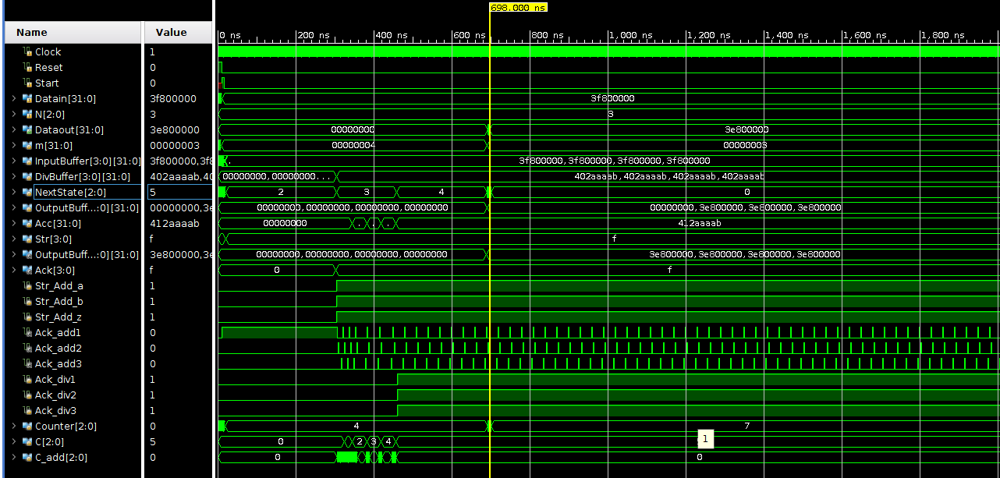

# Verilog implementation of Softmax function
Softmax is a non-linear logistic function commonly used in neural network circuits.

Softmax is denoted with the following equation.
 

Softmax squashes input between 0,1. 
### Softmax graph
 
Taylor series approximation is used to calculate exponential which is donated as follow: 
    f(x) = e^x = 1 + x/1! + x^2/2! + x^3/3! + ....
    
### Implementation Block:
 

### Waveforms
 
